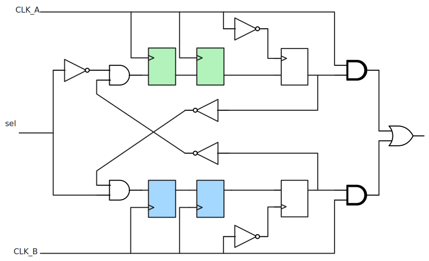
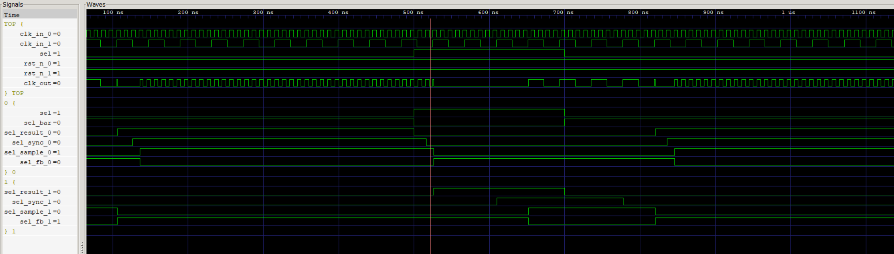
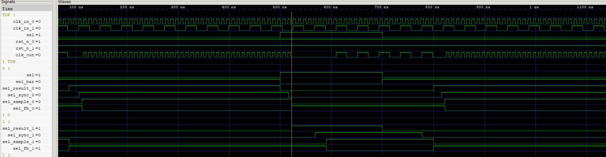
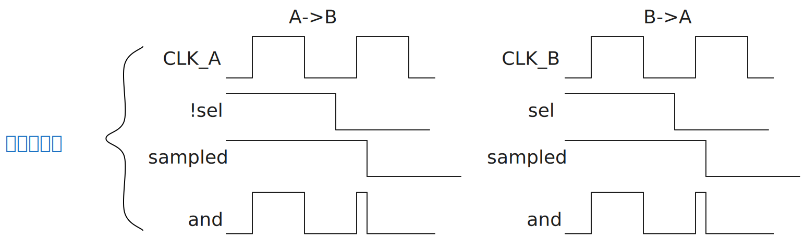
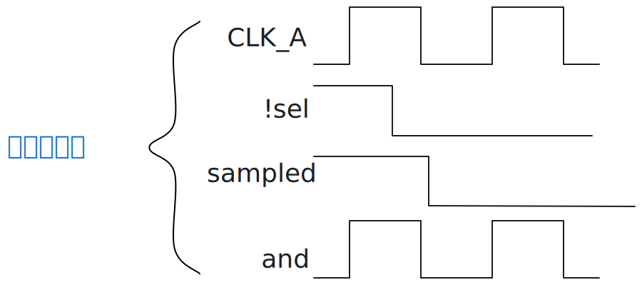
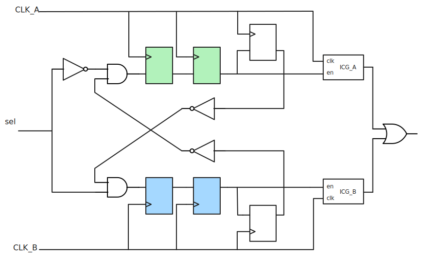
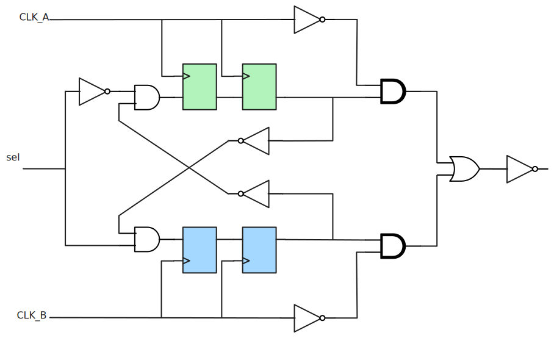
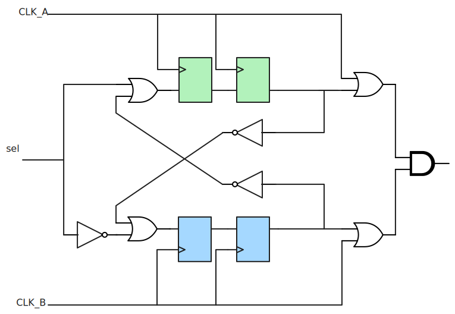

这个仓库是使用Verilog来实验（前仿，增加延时）SoC中常见的无毛刺时钟切换电路。

电路使用的《数字IC设计入门》中的电路

单独的DFF模块，可以方便修改为使用上升沿或下降沿触发器、模拟触发器不同的延迟等。

时钟切换的核心
- 时钟切换的重要原则就是要确保先关断再使能
- 与门在下降沿采样选择信号，或门在上升沿
# 电路1
[clk_exchange1.v](src/clk_exchange1.v)

大致可分4级：

1. sel信号switch
2. 同步器
3. 下降沿采样
4. 时钟与和或

## 下降沿采样的必要性
下图是模拟触发器有一定延迟时采用上升沿采样的现象，有毛刺

下图是同样触发器有延迟，采用下降沿采样的现象，无毛刺

因为是选择信号最终与时钟信号相与，而触发器有一定延迟，采样的信号相比时钟上升沿有一个延迟，而相与之后会产生一个窄脉冲，而这就是我们不希望的时钟毛刺

在A->B和B->A时都可能产生这个毛刺

而如果使用下降沿采样，则就算有延迟，但这个时候时钟为0，相与还是为0。

## 同步器
时钟切换中，哪怕多一些延迟，我们也不希望有毛刺。

这里控制信号以及对方反馈来的信号相对当前时钟都是异步信号，为了避免亚稳态，采用典型2级触发器来实现同步。

# 电路2

# 电路3

# 电路4
